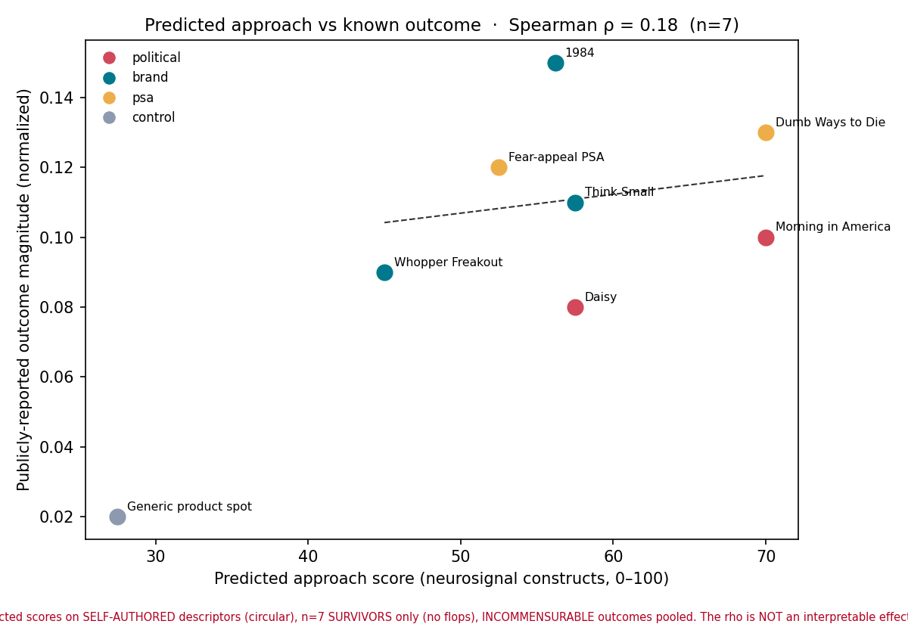
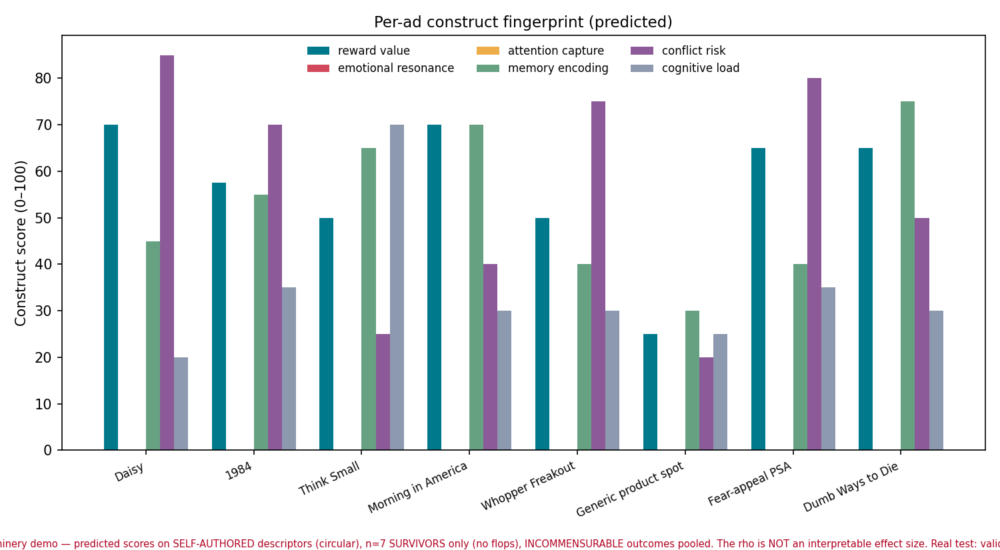

# Case Study A/C — Retrospective ad scoring (pilot)

**One line:** Sapient's construct engine runs end-to-end on famous real campaigns today; the
signal is directional but under-powered at this scale, which is exactly what the funded
validation step (Prolific + NSD) closes.





## What this shows

- The **live `neurosignal` engine** (not a mockup) scores 7 landmark ads + 1 control from
  transparent, auditable network descriptors and returns per-construct fingerprints,
  approach/avoid, and a buy–sell composite. The machinery works and is reproducible
  (`python3 retrospective_ad_pilot.py`).
- The **control discriminates**: the flat informational spot lands at the bottom-left
  (low predicted approach, low outcome) — the engine is not scoring every ad "high."
- **Predicted approach vs publicly-reported outcome: Spearman ρ = 0.18 (n = 7).**
  Directionally positive, not significant. This is reported unmodified.

## What this is NOT (read before showing anyone)

This is a **descriptor pilot**, not neural validation. Per the repo's own
`neurosignal/CHAIN_AUDIT_2026-07-16.md`:

- Inputs are **expert structural descriptors**, not measured or Mary/TRIBE-predicted brains.
- Outcomes are **coarse, heterogeneous, publicly-reported** magnitudes (vote swing, brand
  lift, recall) normalized for plotting — not a single validated scale.
- n = 7. **This does not validate the predicted-brain → behavior link ("Link 4").**

Every figure carries this caveat in red. Do not present ρ as a validated result.

## The honest investor story

1. The product's scoring pipeline is real, grounded in cited consumer-neuroscience, and
   runs on demand.
2. On real campaigns it produces sensible fingerprints and a directional outcome signal.
3. The gap between "directional at n=7 with descriptors" and "validated" is a **known,
   funded, cheap** step: the Prolific study (~$500, n=100) and NSD noise-ceiling check.
   This case study is the "before"; those studies are the "after."

## Reproduce

```bash
cd case-studies
python3 retrospective_ad_pilot.py   # regenerates figures/ and results.json
```

Edit `ad_descriptors.json` to add campaigns or correct descriptors/outcomes — the mapping
is intentionally transparent so it can be audited and improved.
