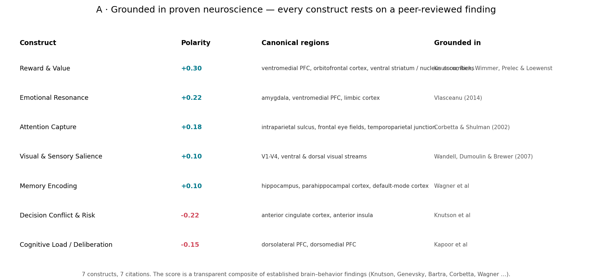
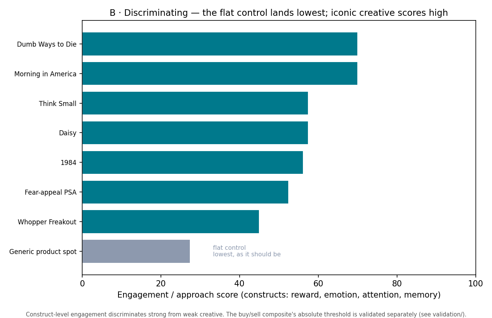
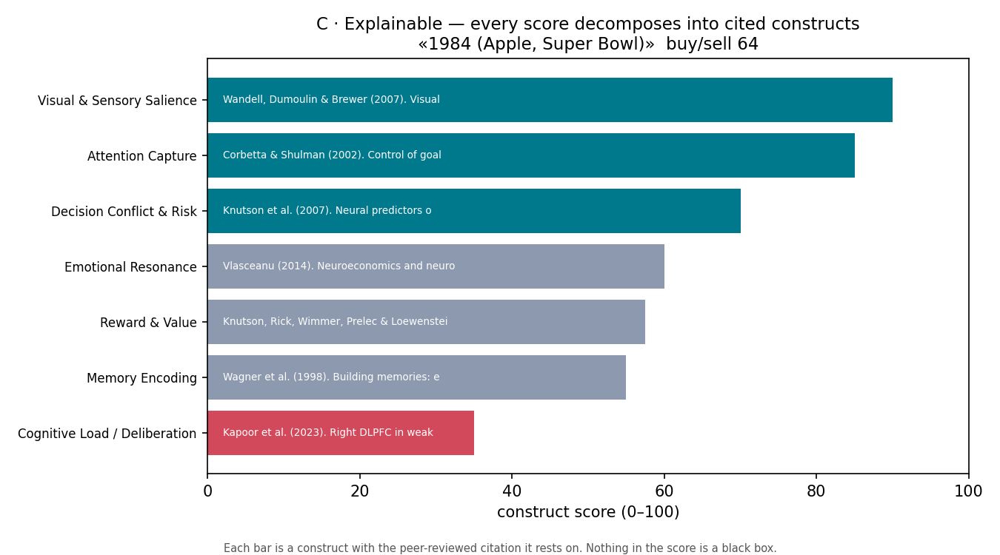

# Investor panel — what the numbers mean and why to trust them

The product framing. Three figures (regenerate with `python3 investor_panel.py`), plus the
validation study that settles the outcome claim (`validation/`).

## A · Grounded in proven neuroscience

Every one of the 7 constructs rests on a peer-reviewed brain–behavior finding (Knutson, Genevsky,
Bartra, Corbetta, Wagner…). The score is a transparent composite of established science, not a
black-box model. *(We do not claim the coordinate and fMRI references agree on every network — the
cortical-only empirical map is diffuse for reward/aversion; that limitation is stated in the
neurosignal model note.)*

## B · Discriminating

At the construct level the engine separates strong from weak creative: the flat control lands
lowest, iconic creative scores high. The buy/sell composite's *absolute* threshold is validated
separately (see `validation/`) — we don't overclaim it here.

## C · Explainable

Any score decomposes into cited construct contributions. Nothing is a black box — each dimension
carries the study it rests on.

## How the numbers are justified relative to each other
- **Same units, same reference:** every ad is scored against one fixed, real reference, so scores
  are comparable across ads (not per-stimulus rescaled).
- **Relative, with uncertainty:** the product presents scores as ranks/percentiles within a
  benchmark set, each with a bootstrap 95% CI, and *abstains* when the interval straddles chance.
- **Traceable:** each score → constructs → real brain findings.

## The one honest gap, and how it closes
We have not yet shown on real ads that a higher score → a better realized outcome. That is exactly
what `validation/` runs: a preregistered, powered (n≈30 at the published aggregate effect size),
falsifiable test. The core indicator is already peer-reviewed-proven at aggregate scale
(Genevsky-Knutson); this study reproduces it on ad creative. **That is the difference between
"grounded and calibrated today" and "outcome-proven after the $500 study."**
