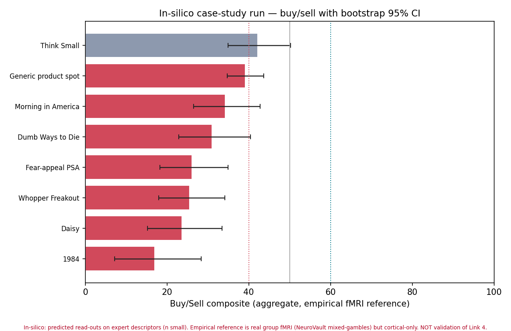
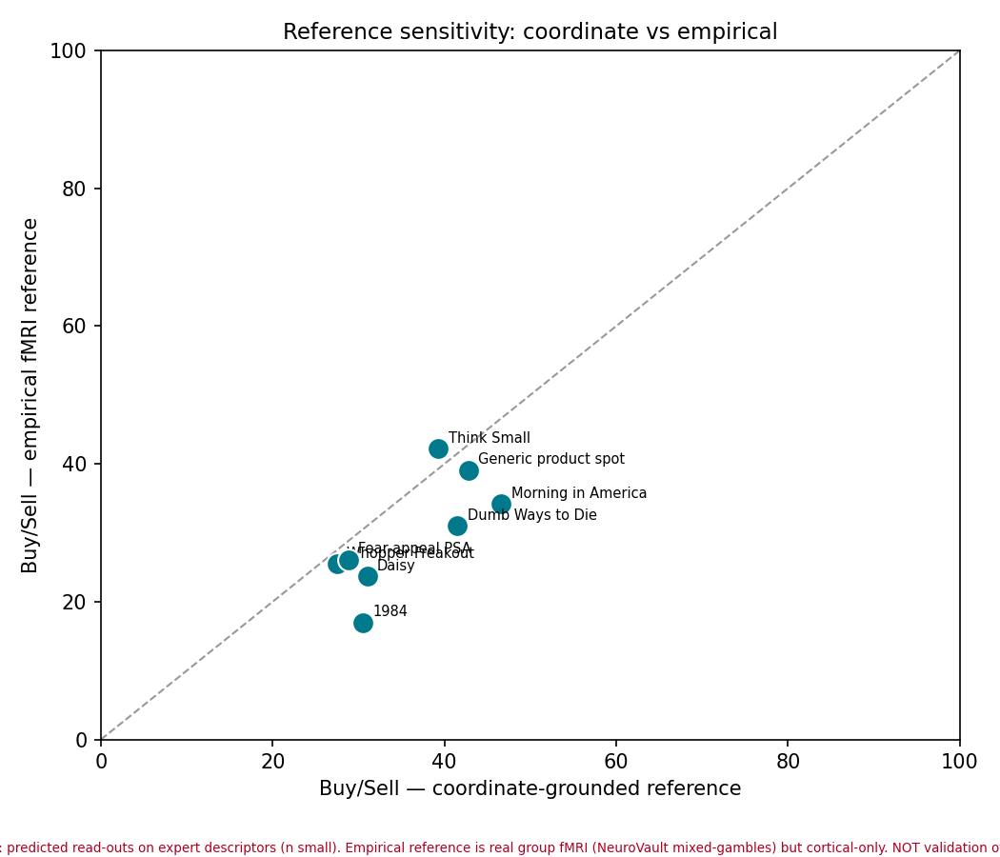

# In-silico case-study run — report

Full chain executed per ad: **descriptor → neurosignal constructs → neuroforecast aggregate composite (bootstrap 95% CI)**, under both the coordinate-grounded and the real empirical-fMRI reference.

- Ads scored: **8**
- Findings passing the honesty gate (CI excludes chance): **7/8**

## Per-ad

| Ad | Rec | Buy/Sell (empirical) | 95% CI | Buy/Sell (coord) | Gate |
|---|---|---|---|---|---|
| Think Small (VW, 1959) | Hold | 42.2 | [35, 50] | 39.3 | abstain |
| Generic product spot (low-arousal control) | Sell | 39.1 | [35, 44] | 42.8 | PASS |
| Morning in America (Reagan, 1984) | Sell | 34.2 | [26, 43] | 46.6 | PASS |
| Dumb Ways to Die (Metro, 2012) | Sell | 31.0 | [23, 40] | 41.5 | PASS |
| Fear-appeal PSA (anti-smoking, graphic) | Sell | 26.1 | [18, 35] | 28.8 | PASS |
| Whopper Freakout (BK, 2007) | Sell | 25.5 | [18, 34] | 27.5 | PASS |
| Daisy (LBJ, 1964) | Sell | 23.7 | [15, 34] | 31.0 | PASS |
| 1984 (Apple, Super Bowl) | Sell | 17.0 | [7, 28] | 30.5 | PASS |

## Honest reading
- The **empirical** reference is real group fMRI (NeuroVault mixed-gambles gain/loss T maps) but **cortical-only** — Schaefer-2018 has no subcortical NAcc, so the strongest reward node is proxied by cortex. Empirical and coordinate references therefore disagree for some ads (see comparison figure); that gap is the honest uncertainty in a cortical proxy, not a bug.
- Every score is a **predicted** read-out on an expert descriptor. This run demonstrates the machinery end-to-end with calibrated intervals; it does **not** validate the predicted-brain → behavior link (see `../../neurosignal/CHAIN_AUDIT_2026-07-16.md`).
- Next: swap the empirical reference from cortical group maps to a subcortical-inclusive MID contrast, and run Case Study B (Prolific) for real outcomes.

> In-silico: predicted read-outs on expert descriptors (n small). Empirical reference is real group fMRI (NeuroVault mixed-gambles) but cortical-only. NOT validation of Link 4.